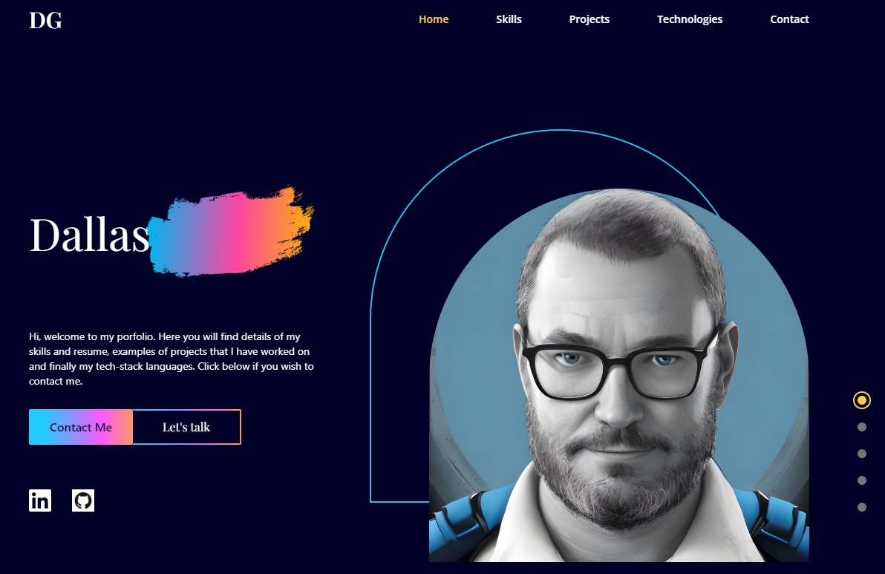
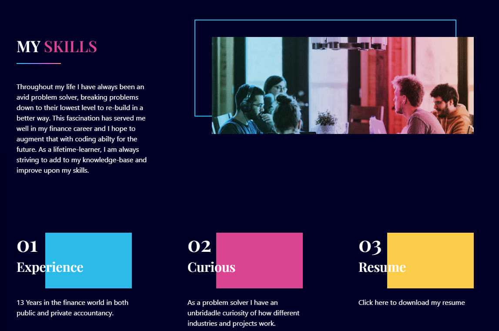
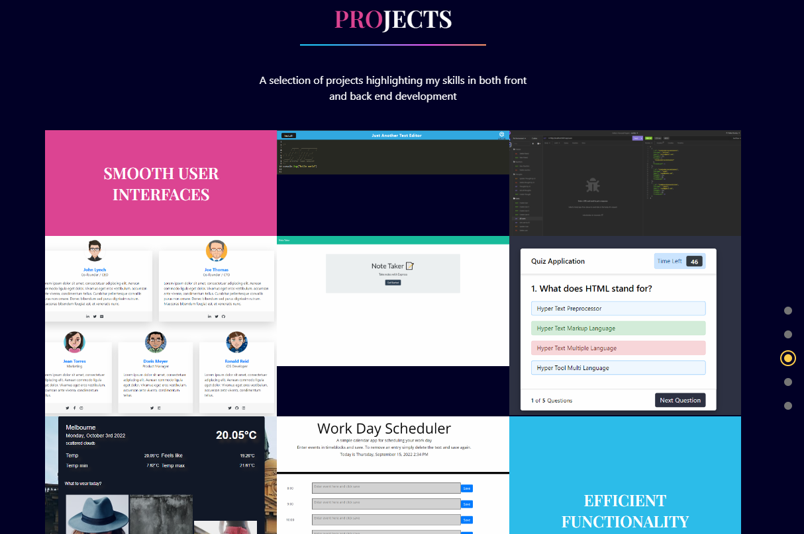

# Dallas Gourley Portfolio

https://dgourley84.github.io/ReactPortfolio/

## License

[](https://opensource.org/licenses/MIT)

https://opensource.org/licenses/MIT


## Table of Contents
* [Description](#description) 
* [Technologies](#technologies)
* [Installation Instructions](#installation)
* [Usage Instructions](#usage)
* [Contribution Guide](#contribute)
* [Tests](#tests)
* [Questions](#questions)


## Description
This is my updated personal portfolio website built using React.js.

It provides an insight into who I am as a developer and gives possible employers an opportunity to contact me.

Upon arrival, the user will land on the home page as seen below:


next, using the navigation bar on the top right, a user can access the about me or projects pages to see more information:





The website is mobile responsive and the most prevelant feature of this is the navigation bar becoming a hamburger menu on mobile devices.


## Technologies
* React
* CSS
* Tailwind CSS
* Node js
* Framer Motion
* GitHub pages


## Installation
To Install and run this application yourself, follow the below step(s).

```
npm i
```
Followed by:
```
npm start
```


## Usage
Once installed and running using the above commands, open the local app in your browser.

The portfolio has also been deployed on github pages - https://dgourley84.github.io/ReactPortfolio/


## Contribute
This project requires some follow development for the future:

* addition a blog;
* refinements to CSS and Tailwind;
* linked projects in an appropriate way


## Tests
This project does not include tests


## Questions
For any questions about the code please see my github for source code, email me at the address provided, or find my social media links on my portfolio website. 
* https://github.com/dgourley84
* dallas.gourley@yahoo.com
